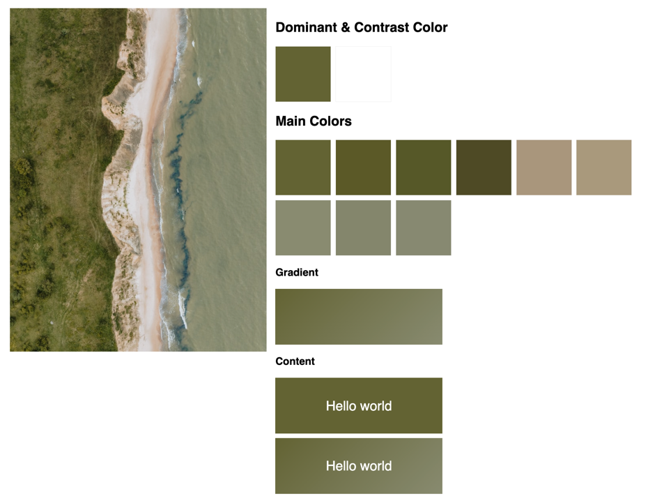

# Get colors of an image

## Example

1. Clone this repository
2. Start a local webserver in the repository directory: `php -S localhost:8081`
3. Open `localhost:8081/example.php` in your browser

Test it with custom images inside the `sample-images` directory.

## Usage

The `ImageColorDetector.php` class is all you need.

You can find an example on how to use it in `example.php`.

## Credits

All images in the `sample-images` directory are from [Unsplash](https://unsplash.com/).
